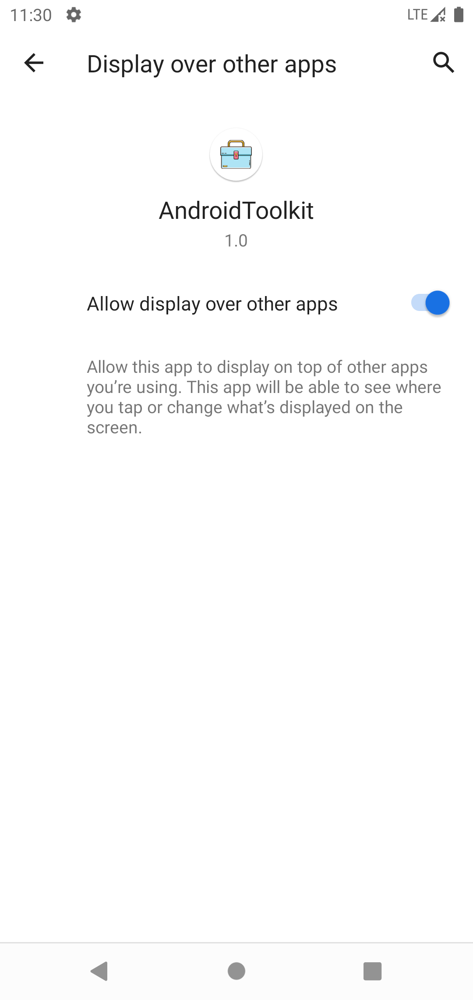
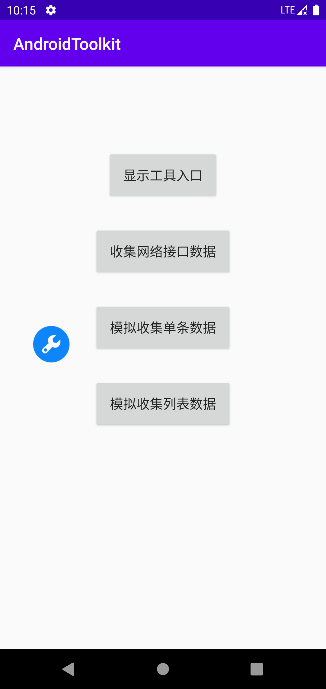
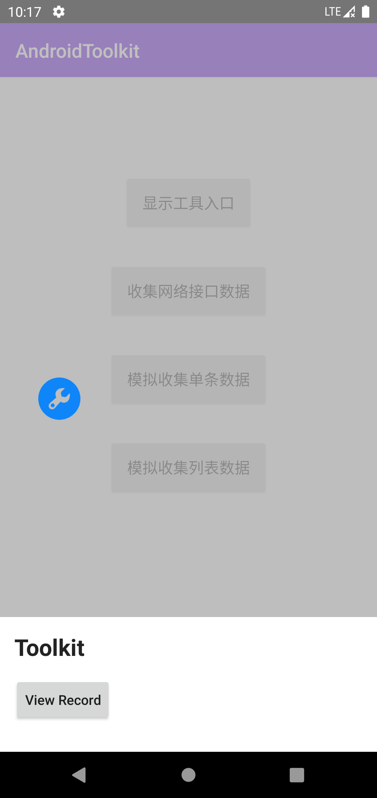
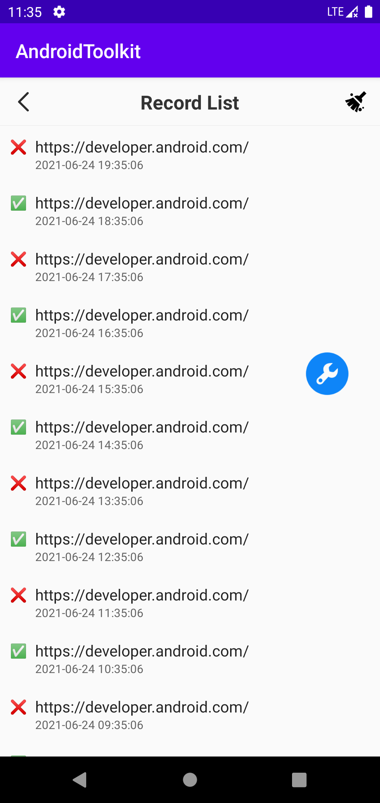
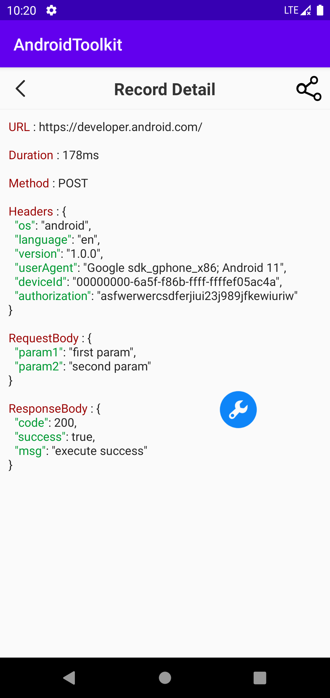
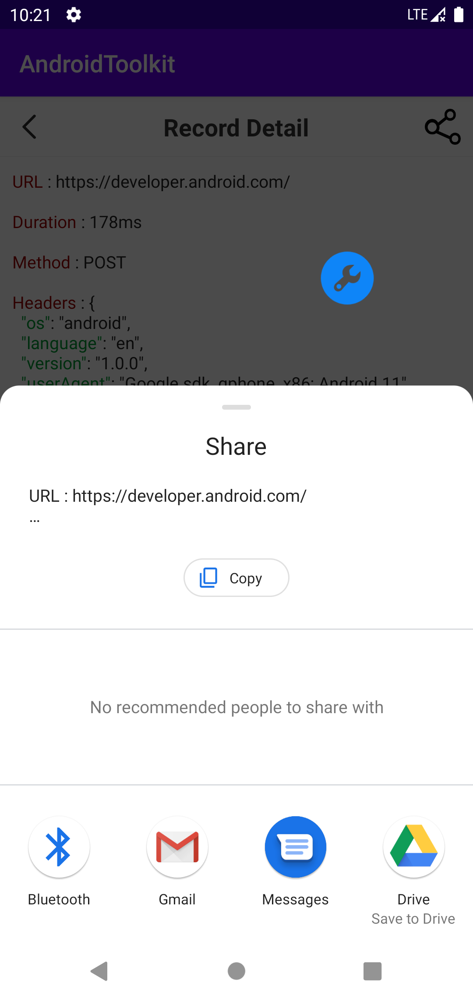

# AndroidToolkit
===================================

- This is a tool that can help Android development engineers and test engineers view network interface logs more conveniently. 
- You can view the status, address and time of the network interface request in the list. 
- In the detail page, because the json has been colored, the entire data looks more intuitive. 
- Of course, you can also share the data to the people you want to share through other apps

<br>




<br>



<br>


## step 1 : update root project build.gradle
```groovy
buildscript {
    repositories {
        mavenCentral()
    }
}
```

## step 2 : update module's build.gradle
```groovy
dependencies {
    implementation 'io.github.weilianyang:toolkit:1.0.0'
}
```


## step 3 : init the toolkit
* I suggest you do initialization in the onCreate method of the Application as early as possible
```kotlin
class App : Application() {

    override fun onCreate() {
        super.onCreate()
        // set config data
        val config = ToolkitConfig.Builder().setDebugMode(BuildConfig.DEBUG).build()
        // init toolkit
        ToolkitPanel.init(this, config)
    }
}
```


## step 4 : display the toolkit entrance
```kotlin
    // Request the permission of the floating window and display the toolkit entrance
    // The logic of applying for permissions and callbacks 
    // has been automatically processed inside the method
    ToolkitPanel.showFloating(this)
```

## step 5 : capture network interface logs
 * If you are using Okhttp, then you only need to add [ApiRecordInterceptor](https://github.com/WeiLianYang/AndroidToolkit/tree/main/toolkit/src/main/java/com/william/toolkit/net/ApiRecordInterceptor) to automatically capture network interface logs.
```kotlin
fun getOkHttpClient(): OkHttpClient {
    val builder = OkHttpClient().newBuilder()
   
    builder.run {

        // Add the interceptor defined in the package
        addInterceptor(ApiRecordInterceptor())

        connectTimeout(TIMEOUT, TimeUnit.SECONDS)
        readTimeout(TIMEOUT, TimeUnit.SECONDS)
        writeTimeout(TIMEOUT, TimeUnit.SECONDS)
    }
    return builder.build()
}
```

* If you don’t want to use the interceptor, also you can use the method provided in the library to manually save the data, and it will work normally, just like this
```kotlin
fun saveRecord() {
    val bean = ApiRecordBean(
        url = "https://developer.android.com/",
        method = "POST",
        headers = "{\"os\":\"android\", \"language\":\"en\"}",
        request = "{\"param1\": \"first param\",\"param2\": \"second param\"}",
        response = "{\"code\": code, \"success\": true, \"msg\": \"execute msg\"}",
        requestTime = System.currentTimeMillis(),
        duration = 100,
        httpCode = 200
    )
    DataManager.saveRecord(bean)
}
```

## Reporting Issues 
* When you find that the component is not working properly, please create an [issue](https://github.com/WeiLianYang/AndroidToolkit/issues) and I will reply in time.


## License
-------

Copyright WeiLianYang

Licensed under the Apache License, Version 2.0 (the "License");
you may not use this file except in compliance with the License.
You may obtain a copy of the License at

http://www.apache.org/licenses/LICENSE-2.0

Unless required by applicable law or agreed to in writing, software
distributed under the License is distributed on an "AS IS" BASIS,
WITHOUT WARRANTIES OR CONDITIONS OF ANY KIND, either express or implied.
See the License for the specific language governing permissions and
limitations under the License.
